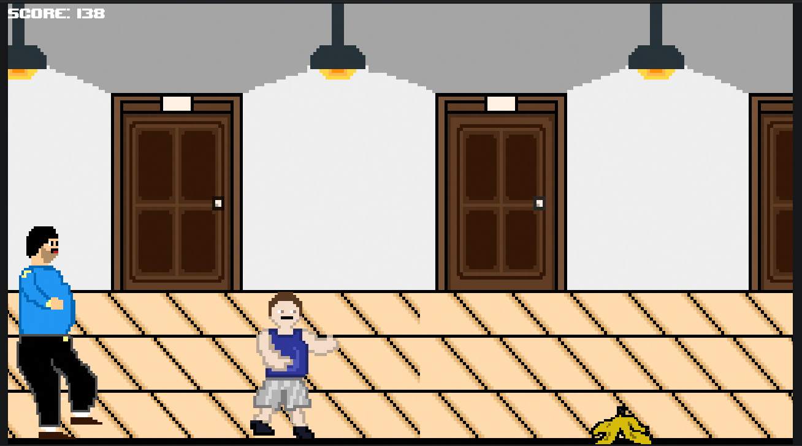
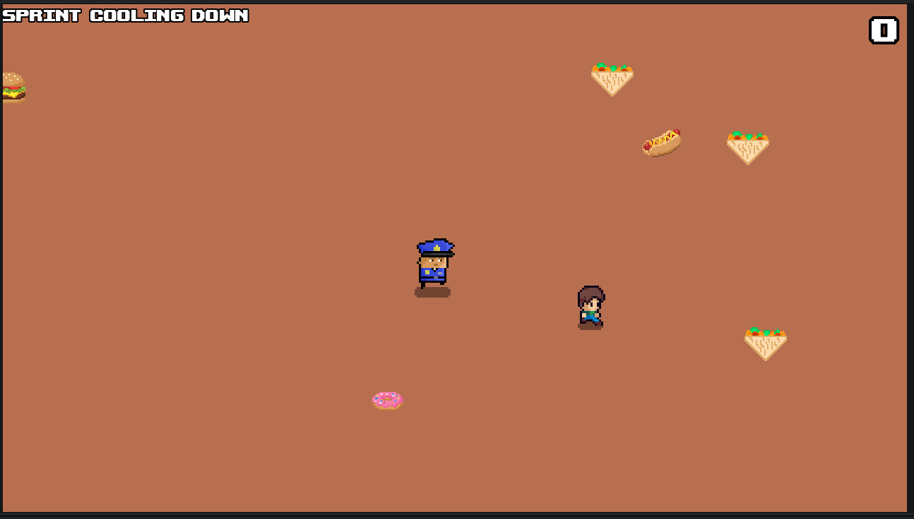
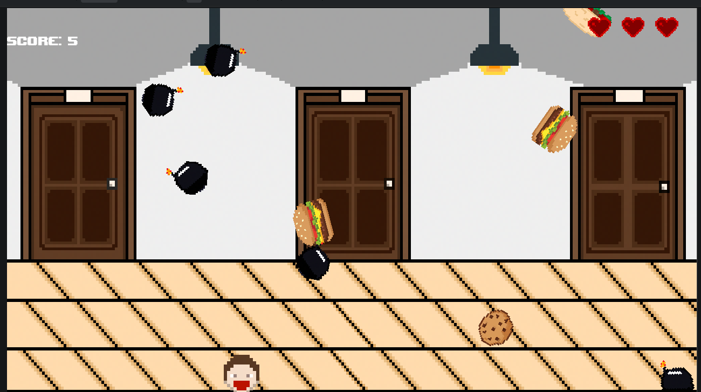

# Asker The Smuggler
## Smuggle Or Starve !
A Game by [hazoro](https://github.com/hazorox) - [AboEl5yr](https://github.com/AdhamMohamedKhairy) - [Vii](https://github.com/vii-abdullatif)

2D Godot game live at [itch.io](https://hazoro.itch.io/asker-the-smuggler)

# Game Idea (Backstory)
--BASED ON A TRUE STORY OF OUR SCHOOLMATE ASKER--
You are a high schooler in a boarding school who got poisoned from dorm food..Although fast food is banned, you decide to smuggle food to eat freely.

You start getting chased by security in the first game mode "RUN" ( Mostly by Aboel5yr )



Afterwards, you gather smuggled food in the "HUNT" gamemode (Fully by Hazoro)



At the end, you enjoy the smuggled food you have :D, while avoiding the dorm food (bombs) in the "HUNGRY" gamemode



# Controls
- Movement : WASD
- Sprint : Left Shift
- Jump : Space
- Fullscreen : Can be accessed through options
- Pause game : Escape

# SETUP
```sh
git clone https://github.com/hazorox/asker-the-smuggler.git
cd asker-the-smuggler
# Open with godot 4.7 or 4.6
```
# Note
some UI buttons work using the keyboard and some work using the mouse
Multiple scenes, especially the corridor, were made by hand using pixil art using lapse 
# AI-Declaration (Hazoro):
Help with debugging issues related accessing children that are to-be removed or are already removed

💖💖

